# Afro Giftshop
[Afro Giftshop](https://afro-giftshop-4485fce00cde.herokuapp.com/) is a project created in order for small tourism businesses to easily keep track of their Giftshop sales, day batch and inventory. It will allow them to keep track of souvenirs sold as well as update them.
It is customisable and editable to allow the user to change their shop batch and inventory items through multiple options.

View the live site [here](https://afro-giftshop-4485fce00cde.herokuapp.com/)

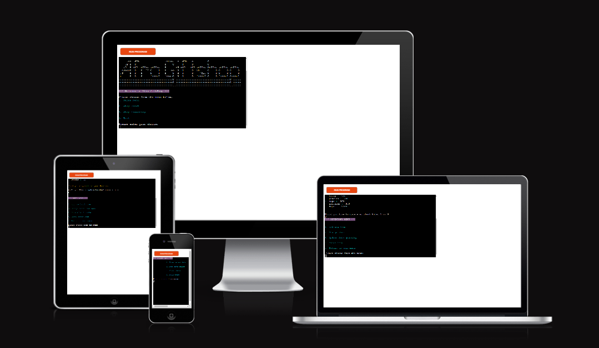

# User Interface 

## User Goals
Afro Giftshop is designed like a 'digital notebook', interactive, safe way for tourism agency to keep track of their mini shop data. 
The data will be viewable via the CLI (Command Line Interface) but stored in a connected, secure, Google worksheet which is not directly accessible to the user. 
Some key user goals for this project have been:

* It must be easy to navigate, with clear Menu options.
* An attractive, bright user interface to engage the user.
* Clear instructions are made available for correct data input.
* The option to clear data if needed.
* Data must be completely editable.

## User Stories 

* As a User, I would like to be able to easily find the various menus so that I can view information or add / edit records.
* As a User, I would like to be able to edit / remove data as neccessary.
* As a User, I would like to be able to view and manage sales so that I can add and find out daily sales with ease.
* As a User, I would like to be able to view daily batch of souvenirs, add, edit / remove data so I can see which souvenirs our customers prefer.
* As a User, I would like to be able to view stor inventory, add, edit / remove data so I can see which items needs to be ordered.
* As a User, I would like to be able to return to the main menu without having to restart the application.

## Structure

### Features

Implementation

* Mian Menu

* Sales Menu

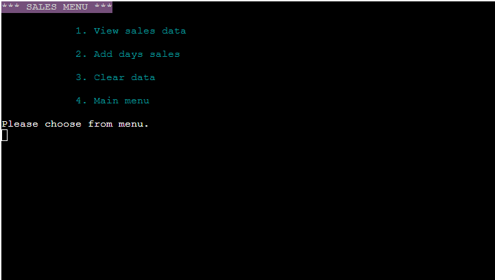

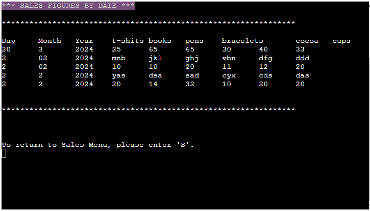

* Store Day Batch

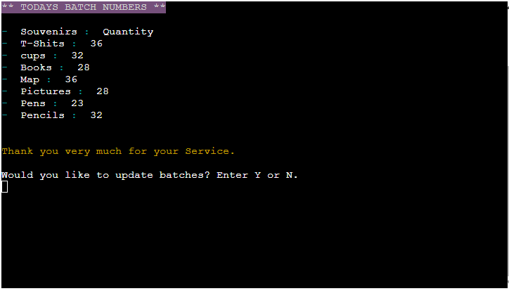

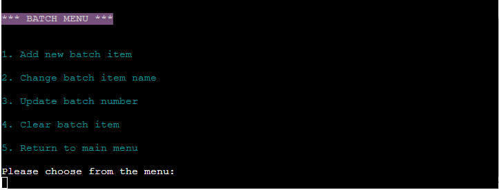

* Store Inventory

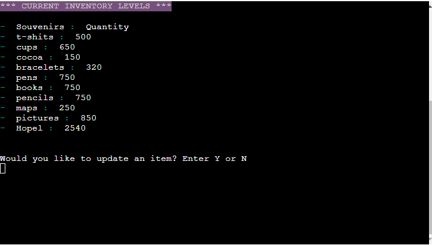

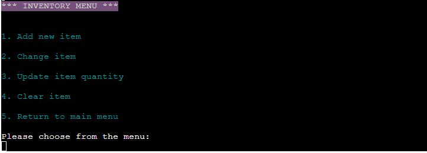

* Return to Menu Page

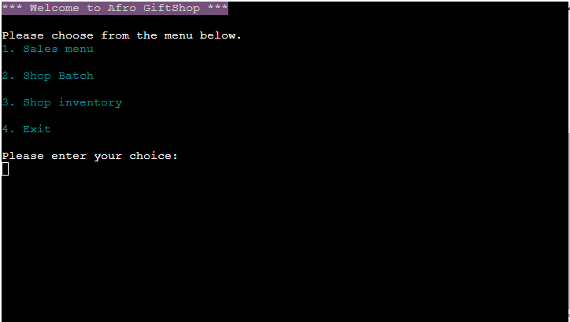

### Features Left to Implement

As a future enhancement, I would like to add some basic functionality to keep track of sales and when to restock the store. 
I would also like to implement reporting to the application that will allow users to know when to put in new orders for restock the inventory.

## Logical Flow

**Main Menu**

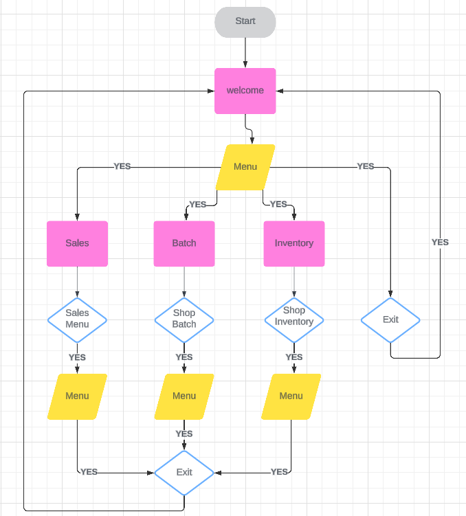

**Sales Menu**

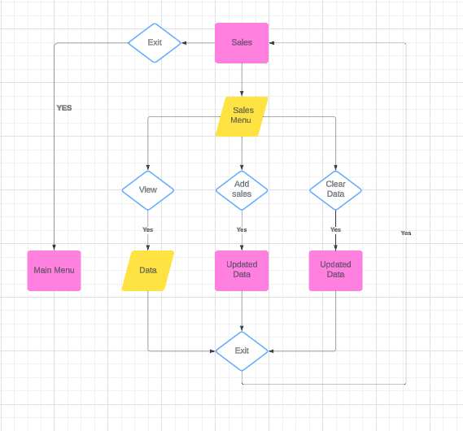

**Shop Day Batch**

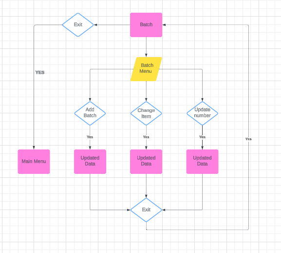

**Shop Inventory**

## Technologies

* Python - Python code written is my own unless referenced in the source code or the below Credits section.
* [Lucidchart](https://www.lucidchart.com) - used to create the flowchart needed during project planning.
* [GitHub](https://github.com/) - used for hosting the program's source code.
* [Gitpod](https://www.gitpod.io/) - used as a workspace for developing the code and testing the program.
* Replit Desktop - used as a workspace for developing the code and testing the program.
* Git - used for version control.
* [Google Sheets](https://docs.google.com/spreadsheets/) - used for storing edited and saved user data.
* [Google Cloud Platform](https://cloud.google.com/) - used to provide the APIs for connecting the data sheets with the Python code.
* [Heroku](https://heroku.com/apps) - used for deploying the project.
* [PEP8 Validator](https://pep8ci.herokuapp.com/#) - used for validating the Python code.

## Libraries & Packages 
**gspread** - gspread was imported and used to add, remove and manipulate data in the connected Google Sheets worksheets.  

**google.oauth.service_account** - This library was used for the authentication needed to access the Google APIs for connecting the Service Account with the Credentials function. A `CREDS.json` file was generated from this with the details needed for the API to access my Google account which holds the Google Sheets worksheet containing the applications data. When deploying to Heroku, this information is then stored in the config var section to ensure the application will run.  

**time & sys** -the time & sys libraries were used for the text-typing effect for typePrint and typeInput statements to create a visual effect 0f the text appearing on screen in real time.  

**os** - os library was used to add the clearScreen() function to assist in creating a neater flow from Menu options by clearing the screen for the user's choice from the Menu to be displayed. 

**colorama** - colorama was imported to give the terminal text colour and style to create a bright and engaging UI and to provide some visual feedback when a user's input is validated.

## Testing

Negative input validation testing was performed on all menu options to ensure correct input. 
All options behaved as expected, alerting the user of invalid inoput and then asking for input again.

### Pep8 Validation

All python code was ran through pep8online.com validator and any warnings or errors were fixed. Code then validated successfully.

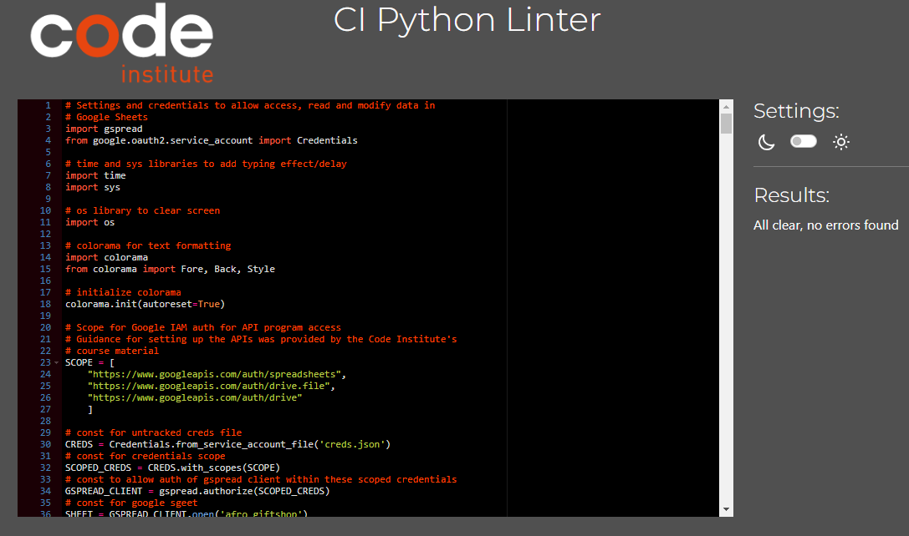

### Bugs and Fixes

After deploying the project with heroku, the whole project menu options crush. In order to fix this errors, the google worksheet had to be redesigned.

## Deployment

The below steps to creating and setting up a new Python workspace and API credentials has been guided by and adapted from the Code Institute's Python walkthrough project 'Love Sandwiches'. Please check each step is relevant to your project needs and change the data entered to suit it.

### Creating a new repository 

Steps to create a new repository.
  

The [Code Institute's Python Essential Template](https://github.com/Code-Institute-Org/python-essentials-template) was used to create a terminal for my Python file to generate it's output. To use this template, please follow these steps:
1. Log in to [GitHub](https://github.com/) or create a new account.
2. Navigate to the above Python template repository.
3. Click '**Use this template**' -> '**Create a new repository**'.
4. Choose a new repository name and click '**Create repository from template**'.
5. In your new repository space, click the green '**Gitpod**' button to generate a new workspace.   

 
  
-----  

### Activating the Google Drive & Sheets API

Steps to activate the APIs

To access the data in a Google Sheets worksheet using Python code, an API is required. Please follow these steps to set up your APIs:  

1. Navigate to the [Google Cloud Platform](https://cloud.google.com), using an email address/Google account that is registered to you alone.
2. In the Google Cloud Platform Dashboard, create a new project by clicking on the '**Select a Project**' button and choosing the '**New Project**' option. Give your new project a name and click '**Create**'. (Your access credentials are unique to each project, so create a new project for every project that you build.) 
3. Click '**Select Project**' in the blue banner to bring you to your project page.
4. Select '**APIs and Services**' from the left side menu, then select '**Library**'.
5. Use the search bar to search for the two APIs needed for this project, Google Drive API and Google Sheets API. One at time, choose the APIs from the search and click '**Enable**' on their main page. Follow the below steps for the Google Drive API, but only click '**Enable**' for the Google Sheets API. There is no need to download credentials again for it.
6. On the API overview page, click '**Create Credentials**' to generate some credentials which will allow us access to our Google Drive from our Python code.
7. Fill out the forms fields and dropdown menus with the information that is relevant to your project. 
8. Under Service Account Details, choose a Service Account name and click '**Create**'.
9. In the Role Dropdown box choose **Basic -> Editor** then press '**Continue**'. Click '**Done**' to finish the form if you do not need to grant users access to the service account if it is a personal project.
10. On the next page, click on your new Service Account that has been created, then click on the '**Keys**' tab to '**Add Key**'. Select '**Create New Key**'.
11. Select JSON and '**Create**'. Your json file containing your API credentials will be downloaded to your machine.

-----  

### Setting up the Gitpod workspace for the APIs

Steps for workspace setup

  
1. In the new Gitpod workspace you've created with the Python Essentials template, click and drag the json file that you created in the above steps, into the Gitpod workspace.  
2. Rename it to `CREDS.json`, if you wish, and open the file. Find the client_email address you previously entered, copy it without the quotes around it.
3. In the Google Sheets file that you have created for this project, click the '**Share**' button and paste the email address into the field, choose '**Editor**', untick '**Notify People**' and click '**Share**'. This allows our project access to the spreadsheet.
4. To ensure the private credentials that you have created do not make their way to the cloud for others to view, add the `creds.json` file to your `gitignore` file before you commit any changes to your repository, and push them to the cloud.
5. Use the command `git status` to check that the `creds.json` file is not staged to be committed.

  
  
-----  

### Initial Code for connecting to our API with Python

Steps to including the Python/API connection code

1. The code needed to ensure your APIs connect correctly can be found at the top of the `run.py` file connected to this project. It is important that you remember to pass the exact same name as your spreadsheet to the `SHEET = GSPREAD_CLIENT.opn('your-filename-here')` code, or else gspread will throw an error.
2. The command `pip3 install gspread google-auth` is needed to install the gspread package for handling the worksheet data and the google-auth package to allow access to the Google Sheets account via the Credentials we downloaded earlier. Use the above command in the Gitbash terminal to install.
3. Please refer to the `run.py` file for the import, SCOPE, CREDS, SCOPED CREDS, GSPREAD CLIENT, SHEET code that is needed to connect the APIs and change any data that is personal to your project.

  
-----  

### Deploying to Heroku  

Heroku has been used to deploy this project as Python is used as a back-end language. To allow for accurate testing, I deployed the project to Heroku early on using Automatic Deployment to update the program everytime new code was pushed to my GitHub repository. 
Here are the guidance was provided by the Code Institute's'Love Sandwiches' project.     

1. Log in to [Heroku](https://id.heroku.com/login) or create an account if you are a new user.
2. Once logged in, in the Heroku Dashboard, navigate to the '**New**' button in the top, right corner, and select '**Create New App**'.
3. Enter an app name and choose your region. Click '**Create App**'.
4. In the Deploy tab, click on the '**Settings**', reach the '**Config Vars**' section and click on '**Reveal Config Vars**'. Here you will enter KEY:VALUE pairs for the app to run successfully. In KEY enter `CREDS`, in VALUE, paste in the text content of your `CREDS.json` file. Select '**Add**'.  
5. Repeat this process with a KEY:VALUE pair of `PORT` and `8000`.
6. In the Settings tab, in the Buildpack section, click '**Add Buildpack**', located near the bottom, right of the refreshed screen. One at a time, choose the '**Python**' pack, save changes, then choose the '**NodeJS**' buildpack and save changes. **NB: the Python buildpack _must_ be above the NodeJS buildpack.**
7. Go to the '**Deploy**' tab and choose GitHub as the Deployment method.
8. Search for the repository name, select the branch that you would like to build from, and connect it via the '**Connect**' button.
9. Choose from '**Automatic**' or '**Manual**' deployment options, I chose the 'Automatic' deployment method. Click '**Deploy Branch**'.
10. Once the waiting period for the app to build has finished, click the '**View**' link to bring you to your newly deployed site.

-----  

### Clone this GitHub Repository

A local clone of this repository can be made on GitHub. Please follow the below steps:

1. Navigate to GitHub and log in.
2. The [Afro Giftshop](https://afro-giftshop-4485fce00cde.herokuapp.com/) can be found at this location.
3. Above the repository file section, locate the '**Code**' button.
4. Click on this button and choose your clone method from HTTPS, SSH or GitHub CLI, copy the URL to your clipboard by clicking the '**Copy**' button.
5. Open your Git Bash Terminal.
6. Change the current working directory to the location you want the cloned directory to be made.
7. Type `git clone` and paste in the copied URL from step 4.
8. Press '**Enter**' for the local clone to be created.
  
## Credits

* [Gareth-McGirr](https://github.com/Gareth-McGirr) my mentor provided great advise in times of need.
* amylour [Bakestok](https://bakestock.herokuapp.com/)
* gspread Documentation is used as reference material and guidance throughout the project for the manipulation of data between Python and Google Sheets: [gspread Docs](https://docs.gspread.org/en/latest/index.html)
* Code Institute's 'Love Sandwiches' project for Google Sheets API and Creds Set-Up.
* 101 Computing for the type-text effect, 'screen sleep', and 'clear screen' effects used throughout the project: [Python typing text effect](https://www.101computing.net/python-typing-text-effect/)
* Python enumerate tutorial by Tech with Tim for searching through Google Sheet data: [Tech with Tim Youtube](https://www.youtube.com/watch?v=-MZiQaNI0QA)
* Python enumerate tutorial via Real Python for looping through data items: [Real Python](https://realpython.com/python-enumerate/)
* Python zip() Function for Parallel Iteration for display of Batch and Inventory items: [Real Python](https://realpython.com/python-zip-function/)
* Linuxhint for their Colorama tutorial and materials: [Linuxhint Colorama & Python](https://linuxhint.com/colorama-python/)  
* [GitHub Docs](https://docs.github.com/en) for information on cloning and forking the repository.
* [Geeks for Geeks](https://www.geeksforgeeks.org/python-programming-language/?ref=ghm) for additional Python learning.
* ASCII art used in the project was generated by [potorjk.com](https://patorjk.com/software/taag/#p=display&f=Graffiti&t=Type%20Something%20).
