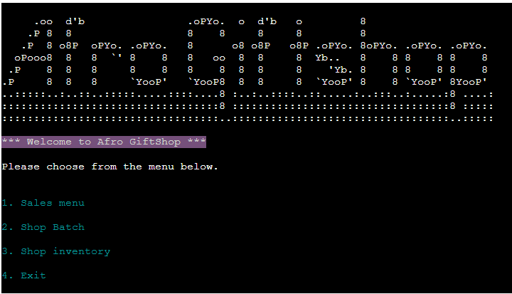

# Afro Giftshop
[Afro Giftshop](https://afro-giftshop-4485fce00cde.herokuapp.com/) is a project created in order for small tourism businesses to easily keep track of their Giftshop sales, day batch and inventory. It will allow them to keep track of souvenirs sold as well as update them.
It is customisable and editable to allow the user to change their shop batch and inventory items through multiple options.

View the live site [here](https://afro-giftshop-4485fce00cde.herokuapp.com/)

# User Experience/User Interface (UX/UI)  

## User Goals
Afro Giftshop is designed like a 'digital notebook', interactive, safe way for tourism agency to keep track of their mini shop data. 
The data will be viewable via the CLI (Command Line Interface) but stored in a connected, secure, Google worksheet which is not directly accessible to the user. 
Some key user goals for this project have been:

* It must be easy to navigate, with clear Menu options.
* An attractive, bright user interface to engage the user.
* Clear instructions are made available for correct data input.
* The option to clear data if needed.
* Data must be completely editable.

## User Stories 

* As a User, I would like to be able to easily find the various menus so that I can view information or add / edit records.
* As a User, I would like to be able to edit / remove data as neccessary.
* As a User, I would like to be able to view and manage sales so that I can add and find out daily sales with ease.
* As a User, I would like to be able to view daily batch of souvenirs, add, edit / remove data so I can see which souvenirs our customers prefer.
* As a User, I would like to be able to view stor inventory, add, edit / remove data so I can see which items needs to be ordered.
* As a User, I would like to be able to return to the main menu without having to restart the application.

## Structure

### Features

Implementation

* Mian Menu

* Sales Menu

* Store Day Batch

* Store Inventory

* Return to Menu Page

### Features Left to Implement

As a future enhancement, I would like to add some basic functionality to keep track of sales and when to restock the store. 
I would also like to implement reporting to the application that will allow users to know when to put in new orders for restock the inventory.

## Logical Flow

**Main Menu**

**Sales Menu**

**Shop Day Batch**

**Shop Inventory**

## Database Design

## Technologies

* Python - Python code written is my own unless referenced in the source code or the below Credits section.
* [Lucidchart](https://www.lucidchart.com) - used to create the flowchart needed during project planning.
* [GitHub](https://github.com/) - used for hosting the program's source code.
* [Gitpod](https://www.gitpod.io/) - used as a workspace for developing the code and testing the program.
* Replit Desktop - used as a workspace for developing the code and testing the program.
* Git - used for version control.
* [Google Sheets](https://docs.google.com/spreadsheets/) - used for storing edited and saved user data.
* [Google Cloud Platform](https://cloud.google.com/) - used to provide the APIs for connecting the data sheets with the Python code.
* [Heroku](https://heroku.com/apps) - used for deploying the project.
* [PEP8 Validator](https://pep8ci.herokuapp.com/#) - used for validating the Python code.

## Testing

### Functional Testing

### Pep8 Validation

### Bugs and Fixes

## Deployment

### Version Control

### Heroku Deployment

## Credits